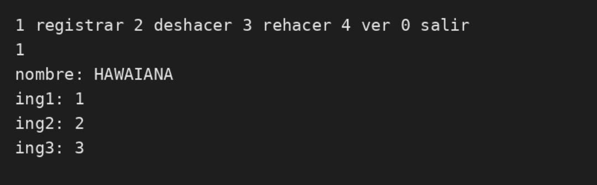
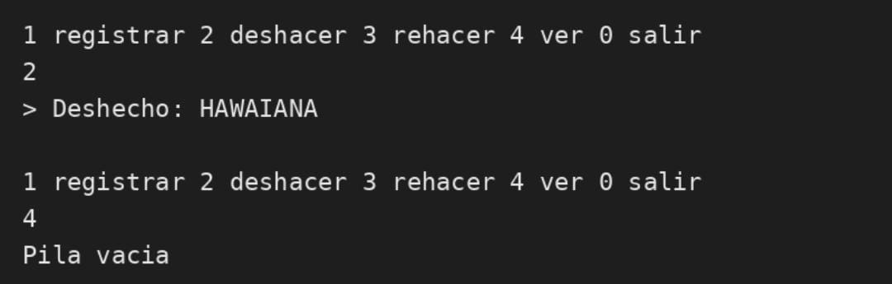
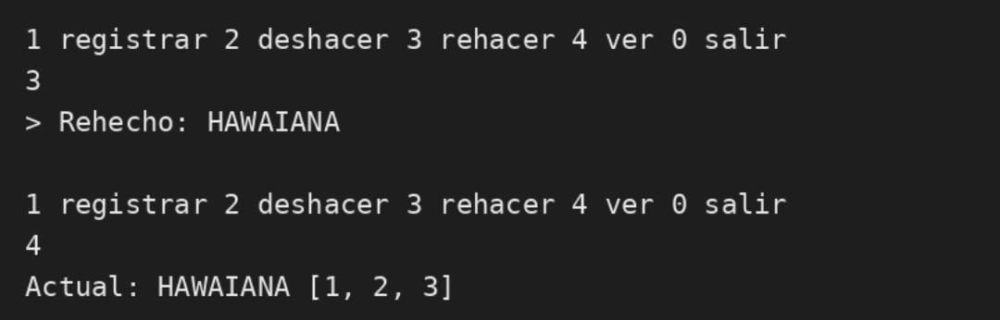

# Pizza-track - Sistema de Pilas Undo / Redo

Proyecto en Java que implementa el patrón Undo/Redo usando Pilas para el registro de pizzas.

## Estructura
- `src/Main.java` - Menú principal
- `src/GestionPedidos.java` - Lógica de registrar, deshacer y rehacer
- `src/Pila.java` - Implementación de la pila
- `src/Nodo.java` - Nodo
- `src/Pizza.java` - Modelo pizza

## Evidencias de Funcionamiento

### 1. Registro de Pizza HAWAIANA

### 2. Undo - Pila Vacía

### 3. Redo - Recuperación

### 4. Video sustentacion
[Video Sustentación - Jhon Paternina](https://drive.google.com/file/d/1b2ZnQ4tXiUIS9uiKedPKxlOOuOOV5K5a/view?usp=sharing)
Correccion final entrega
Entrega final completada
